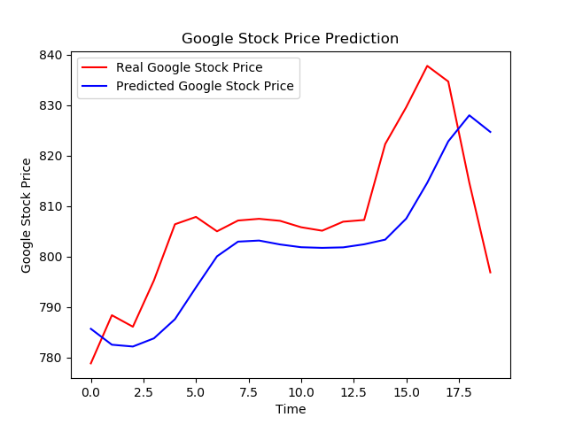

# Google's stock price prediction
a recurrent neural network (RNN) implementation of Google Stock-price prediction for predicting the upward/downward trends in the stock-prices. This does not predict/forecast the actual stock prices as market can be volatile driven by a number of factors but the model does predicts the next possible trend in the stock prices.  In a layman's language it predicts the trend in stock-prices as to whether the prices would go up or fall down for the stocks.

